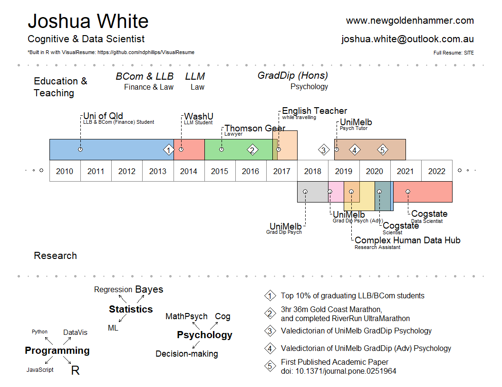

<!-- README.md is generated from README.Rmd. Please edit that file -->

# CV

My attempts at creating a CV(s) using R packages ‘pagedown’ and
’VisualResume\`.

<!-- badges: start -->
<!-- badges: end -->

## Visual Resume

Below is my visual resume made with the `VisualResume`
[package](https://github.com/ndphillips/VisualResume).

``` r
#devtools::install_github("ndphillips/VisualResume")
library(VisualResume)

VisualResume(
  titles.left = c(
    "Joshua White",
    "Cognitive & Data Scientist",
    "*Built in R with VisualResume: https://github.com/ndphillips/VisualResume"
    ),
  titles.right = c(
    "www.newgoldenhammer.com",
    "joshua.white@outlook.com.au", 
    "Full Resume: SITE"
    ),
  titles.right.cex = c(2, 2, 1),
  titles.left.cex = c(4, 2, 1),
  timeline.labels = c("Education", "Research"),
  timeline = 
    data.frame(
      title = c("Uni of Qld", "WashU", "Thomson Geer", "English Teacher",
                "UniMelb", "UniMelb", "Complex Human Data Hub", "Cogstate", 
                "Cogstate"),
      sub = c("LLB & BCom (Finance) Student", "LLM Student", "Lawyer", 
              "while travelling", "Grad Dip Psych", "Grad Dip Psych (Adv)",
              "Research Assitant", "Scientist", "Data Scientist"),
      start = c(2010, 2014, 2015, 2017.2, 2018, 2019, 2019.5, 2020.5, 2021.1),
      end = c(2014, 2015, 2017.35, 2018, 2019, 2020, 2021, 2021.1, 2023),
      side = c(1, 1, 1, 1, 0, 0, 0, 0, 0)),
  milestones = 
    data.frame(
      title = c("BCom & LLB", "LLM", "GradDip (Hons)"),
      sub = c("Finance & Law", "Law", "Psychology"),
      year = c(2014, 2015, 2019)),
  events = data.frame(
    year = c(2014, 2016, 2018, 2019, 2020),
    title = c("Top 10% of graduating LLB/BCom students",
              "3h:36m Gold Coast Marathon,\nand completed RiverRun UltraMarathon",
              "Valedictorian of UniMelb GradDip Psychology",
              "Valedictorian of UniMelb GradDip (Adv) Psychology",
              "First Published Academic Paper\ndoi: 10.1371/journal.pone.0251964")),
  interests = 
    list(
      "Programming" = c(rep("R", 30), rep("DataVis", 9), rep("JavaScript", 2), "Python"),
      "Statistics" = c(rep("ML", 1), rep("Regression", 3), rep("Bayes", 2)),
      "Psychology" = c(rep("Cog", 3), rep("MathPsych", 3), rep("Decision-making", 3))),
  year.steps = 1
)
```



## PDF Resume
