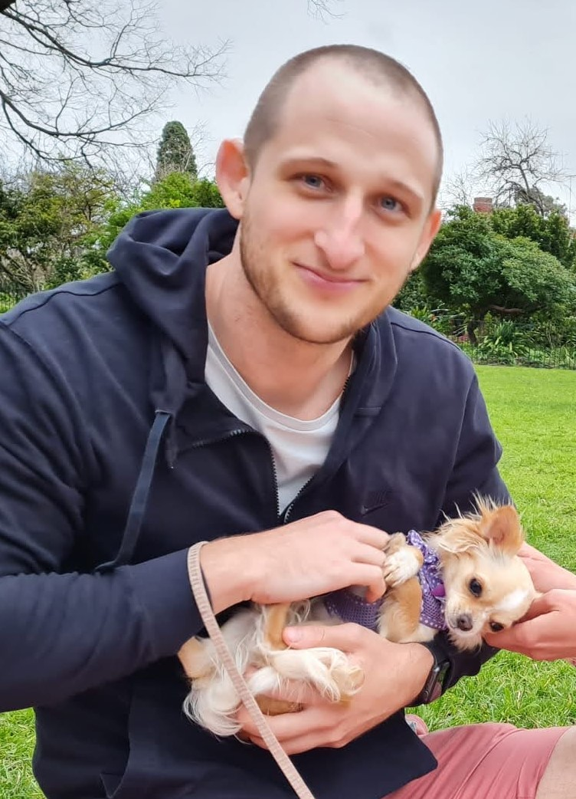

Aside
================================================================================

{width=80%}

Contact Info {#contact}
--------------------------------------------------------------------------------

- <i class="fa fa-envelope"></i> joshua.white@outlook.com.au
- <i class="fa fa-phone"></i> +61 415 931 248
- <i class="fas fa-home"></i> 35 Campbell Street
- <i class="fab fas-linkedin"></i> Collingwood VIC 3066

Links {#links}
--------------------------------------------------------------------------------

- <i class="fas fa-link"></i> [joshuapwhite.com](https://joshuapwhite.com)
- <i class="fa fa-sharp fa-solid fa-graduation-cap"></i>[ Google Scholar Page](https://scholar.google.com/citations?user=9lD32xkAAAAJ)
- <i class="fa fa-github"></i> [WhiteJP](https://github.com/WhiteJP)
- <i class="fab fa-stack-overflow"></i> [josh-white](https://stackoverflow.com/users/20289207/josh-white)
- <i class="fab fa-linkedin"></i> [joshua-p-white](https://www.linkedin.com/in/joshua-p-white/)
- <i class="fa fa-twitter-square"></i> [J_P_White](https://twitter.com/J_P_White)

Tech skills {#techskills}
--------------------------------------------------------------------------------
<!-- ★☆ -->

 

  

Statistical SKills {#statskills}
--------------------------------------------------------------------------------

Bayesian modeling/statistics   
Machine learning   
Data visualisation   

<!--
References {#references}
--------------------------------------------------------------------------------

References will be provided upon request.
-->

Disclaimer {#disclaimer}
--------------------------------------------------------------------------------

This resume was made with the R package [**pagedown**](https://github.com/rstudio/pagedown).  
Last updated on `r Sys.Date()`.

Main
================================================================================

Joshua White {#title}
--------------------------------------------------------------------------------

### Data Scientist, Cognitive Scientist & PhD Applicant

I'm a Cognitive & Data Scientist who recently finished his Honours in Psychology 
at the University of Melbourne. I am seeking to undertake PhD studies to fulfill 
my long standing life ambition of joining the academy. I'm interested in using 
big data and computational modeling/methods to better understand the mind, 
particularly in relation to social, moral, legal, and political matters. 

Education {data-icon=graduation-cap data-concise=true}
--------------------------------------------------------------------------------

### Graduate Diploma (Advanced) in Psychology

GPA: 94.5/100

University of Melbourne

2019

### Graduate Diploma in Psychology

GPA: 92.7/100

University of Melbourne

2018

### Master of Laws in Negotiation and Dispute Resolution

GPA: 3.69/4

Washington University in Saint Louis

2014

### Bachelor of Commerce    

GPA 6.25/7, Majored in Finance.

University of Queensland

2014

### Bachelor of Laws

GPA 5.63/7, Honours class IIA

University of Queensland

2014

Honours and Awards {data-icon=award data-concise=true}
--------------------------------------------------------------------------------

### Australian Psychological Society Prize for Fourth-year Psychology 

Top-ranking graduating student.

University of Melbourne

2019

### Dean’s Honours List for the Graduate Diploma in Psychology 

Top-ranking graduating student.

University of Melbourne

2018

### Behavioural Neuroscience Prize

Highest grades in Behavioural Neuroscience subjects

University of Melbourne

2018

### Dean's Honour Roll

Top 10% of graduating LLB/BCom class

University of Queensland

2014

### Dean's Commendation of High Achievement

Exceptional grades --- Semester 1, 2010 & Semester 2, 2011 

University of Queensland

2011 - 2010

Research Experience {data-icon=laptop}
--------------------------------------------------------------------------------

### Data Scientist

Cogstate Ltd

Melbourne, Australia

Present - 2020

-	Undertake statistical analysis, and apply machine learning algorithms, on computerized computer tests to support their development
-	Undertake statistical analysis on clinical trial data to support internal decision-making. 
-	Maintain internal R package, used to support analytic activities within Cogstate. 

### Volunteer Research Assistant to A/Prof. Andrew Perfors

Computational Cognitive Science Lab

University of Melbourne

2022 - 2019

- Investigated ambiguity aversion in ‘qualitative’ contexts, from a Bayesian perspective. 
- Lead all aspects of research process: conceptualized, designed and coded (JavaScript) experiment, completed ethics application, collected and analyzed data, wrote paper, responded to reviewers. 

### Research Assistant -- RepliCATS project 

The University of Melbourne

Melbourne, Australia

2021

Read, analyzed, and discussed social science papers from many fields and make judgements as to their credibility, generalizability, replicability and plausibility, to support the generation of algorithms that may be able to predict research replicability. 

### Complex Human Data Hub Research Assistant

Melbourne School of Psychological Sciences (MSPS)

University of Melbourne

2021 - 2020

- Investigated the ‘social licence’ for the use of location tracking technologies and vaccination passports in response to the COVID-19 pandemic, in a multi-country, longitudinal, multi-paper project. 
- Involved in: Securing funding, conceptualizing and creating surveys (Qualtrics), designing and undertaking statistical analyses, writing papers and responding to reviewers. 

### Research Assistant to Prof. Simon Dennis

Memory and Language Lab

University of Melbourne

2020 - 2019

-	Investigated the ‘social licence’ for the use of location tracking technologies on university campus to support university research and services. 
-	Lead: designing and creating experiment (Qualtrics), completing ethics application, collecting data, developing and undertaking statistical analyses, writing manuscript and responding to reviewers.

### Psychology Honours Project

**Supervisor:** A/Prof. Stefan Bode

University of Melbourne

2019

- Investigated the decision process of moral judgements of fairness through a response-time paradigm based on the dictator game, utilizing computational and statistical modelling. 
- Piloted experiment, collected and analyzed data, helped to write manuscript and respond to reviewers. 

### Psychology Capstone Project

**Supervisor:** A/Prof. Daniel Little

University of Melbourne

2018

- Investigated whether people could tell the difference between human responses to Raven’s Progressive Matrices, and responses from a Bayesian computational model thereof (Little, Lewandowksy & Griffiths, 2012).
- Developed experimental paradigm, collected and analyzed data, wrote lab report. 

Teaching Experience {data-icon=chalkboard-teacher}
--------------------------------------------------------------------------------

### Psychology and Statistics/Data Analysis

Melbourne School of Psychological Sciences (MSPS)

University of Melbourne

2022 - 2019

Taught the following classes at the University of Melbourne:

- Advanced Design and Data Analysis (PSYC40005)
- Advanced Research Methods in Psychology (PSYC40014)
- Mind, Brain & Behaviour 1 (PSYC10003)
- Mind, Brain & Behaviour 2 (PSYC10004)
- Cognitive Psychology (PSYC20007)
- Personality and Social Psychology (PSYC20009) 

### English-as-a-Second-Language Teacher

Self-employed, italki.com

N/A

2019 - 2017

Teaching English to upper-intermediate/advanced English learners. 

Other Professional Experience {data-icon=suitcase}
--------------------------------------------------------------------------------

### Lawyer

Thomson Geer 

Brisbane, Australia

2017 - 2015

- Act for liquidators, banks, finance companies etc. in insolvency litigation.
-	Draft court documents, and appear in person, in relation to matters at the Magistrates, District and Supreme Courts of Queensland and High Court of Australia. 

Academic Publications {data-icon=file}
--------------------------------------------------------------------------------

### Sensitivity of individfual and composite test scores from the Cogstate Brief Battery to mild cognitive impariment and dementia due to Alzheimer's disease

Manuscript in Preparation

N/A

2022

**Joshua P. White**, Adrian Schembri, Carmen Prenn-Gologranc, Maetj Ondrus,  
Stanislav Katina, Petr Novak, Yen Ying Lim, Chris Edgar, Colin L. Masters, Paul Maruff

### [COVID-19, culture, and the privacy calculus: factors predicting the cross-cultural acceptance and uptake of contact tracing technologies](https://psyarxiv.com/zeqn7/)

Submitted to PNAS Nexus

N/A

2022

Paul M. Garrett, **Joshua P. White**, Yin Luo, Simon Dennis, Nicholas Geard, Daniel R. Little, Lewis Mitchell, Andrew Perfors, Martin Tomko, Giulia Andrighetto, Andrea Guido, Takashi Kusumi, Ralph Herwig, Stefan Herzog, Anastasia Kozyreva, Phillipp Lorenz-Spreen, Thorsten Pachur, Shulan Hsieh, Yi-Chan Lee, Cheng-Ta Yang, Yasmina Okan, Elena Maria Andrade Fernandez, Luis Miguel Velay Vivel, Klaus Oberauer, Robert Goldstone, Stephan Lewandowsky, Yoshihisa Kashima

### Detection of Mild Cognitive Impairment Using In-clinic and Remote Unsupervised Digital Cognitive Assessments (Abstract)

Alzheimer's & Dementia: The Journal of the Alzheimer's Association

N/A

2022

**Joshua P. White**, Chris Edgar, Eric Siemers, Paul Maruff

### [Ambiguity attitudes in qualitative contexts: The role of prior beliefs](https://doi.org/10.1002/bdm.2292)

Journal of Behavioral Decision Making

N/A

2022

**Joshua P. White**, Andrew Perfors

### [Papers please: Predictive factors for national and international COVID-19 immunity and vaccination passport uptake as determined by representative surveys](https://doi.org/10.2196/32969)

JMIR Public Health and Surveillance

N/A

2022

Paul M. Garrett, **Joshua P. White**, Simon Dennis, Stephan Lewandowsky, Cheng-Ta Yang, Yasmina Okan, Andrew Perfors, Daniel Little, Anastasia Kozyreva, Philipp Lorenz-Spreen, Takashi Kusumi, and Yoshihisa Kashima

### [High acceptance for COVID-19 tracing technologies in Taiwan: A nationally representative survey analysis](https://doi.org/10.3390/ijerph19063323)

International Journal of Environmental Research and Public Health

N/A

2022

Paul M. Garrett, Yu Wen Wang, **Joshua P. White**, Yoshihisa Kashima, Simon Dennis, Cheng-Ta Yang

### [Response time modelling reveals evidence for multiple, distinct sources of moral decision caution](https://doi.org/10.1016/j.cognition.2022.105026)

Cognition

N/A

2022

Milan Andrejević, **Joshua P. White**, Daniel Feuerriegel, Simon Laham, Stefan Bode

### [A Paradox in Digital Memory Assessment: Increased Sensitivity With Reduced Difficulty](https://doi.org/10.3389/fdgth.2021.780303)

Frontiers in Digital Health

N/A

2021

**Joshua P. White**, Adrian  Schembri, Chris J. Edgar, Yen Ying Lim, Colin L. Masters, Paul Maruff

### [Young adults view smartphone tracking technologies for COVID-19 as acceptable: the case of Taiwan
](https://doi.org/10.3390/ijerph18031332)

International Journal of Environmental Research and Public Health

N/A

2021

Paul M. Garrett, Yu Wen Wang, **Joshua P. White**, Shulan Hsieh, Carol Strong, Yi-Chan Lee,  Stephan Lewandowsky, Simon Dennis, Cheng-Ta Yang

### [Public acceptance of Privacy-Encroaching Policies to Address the COVID-19 Pandemic in the United Kingdom](https://doi.org/10.1371/journal.pone.0245740)

PLoS ONE

N/A

2021

Stephan Lewandowsky, Simon Dennis, Amy Perfors, Yoshihisa Kashima, **Joshua P. White**, Paul Garrett,  Daniel R. Little,  Muhsin Yesilada

### [The acceptability and uptake of smartphone tracking for COVID-19 in Australia](https://doi.org/10.1371/journal.pone.0244827)

PLoS ONE

N/A

2021

Paul M. Garrett, **Joshua P. White**, Stephan Lewandowsky, Yoshihisa Kashima, Andrew Perfors, Daniel R. Little,  Nic Geard, Lewis Mitchell, Martin Tomko, Simon Dennis

### [Paths to social licence for tracking-data analytics in university research and services](https://doi.org/10.1371/journal.pone.0251964)

PLoS ONE

N/A

2021

**Joshua P. White**, Simon Dennis, Jessica Bell, Martin Tomko, Stephan Winter

General Audience Publications {data-icon=leanpub}
--------------------------------------------------------------------------------

### [Privacy and Health: The Lessons of COVID-19 ](https://pursuit.unimelb.edu.au/articles/privacy-and-health-the-lessons-of-covid-19)

Pursuit, University of Melbourne

N/A

2021

Paul Garrett, **Joshua P. White**, Simon Dennis, Nic Geard, Yoshi Kashima, Daniel Little, Andy Perfors, Martin Tomko, Stephan Lewandowsky,  Lewis Mitchell

### [70% of people surveyed said they’d download a coronavirus app. Only 44% did. Why the gap?](https://theconversation.com/70-of-people-surveyed-said-theyd-download-a-coronavirus-app-only-44-did-why-the-gap-138427)

The Conversation

N/A

2020

Simon Dennis, Paul Garrett, Daniel Little, Amy Perfors, Yoshi Kashima, **Joshua P. White**, Stephan Lewandowsky, Nic Geard, Lewis Mitchell

### [Decreasing support for immunity passports amongst Australians, but this depends on age](https://psychologicalsciences.unimelb.edu.au/research/hubs/chdh/news/decreasing-support-for-immunity-passports-amongst-australians,-but-this-depends-on-age)

Complex Human Data Hub News, University of Melbourne

N/A

2020

**Josh White**, Paul Garrett, Simon Dennis, Daniel Little, Amy Perfors, Yoshi Kashima, Stephan Lewandowsky 

### [Do Australians support ‘Immunity Passports’ in response to the COVID-19 pandemic?](https://psychologicalsciences.unimelb.edu.au/research/hubs/chdh/news/immunity-passport-support-australia)

Complex Human Data Hub News, University of Melbourne

N/A

2020

**Josh White**, Paul Garrett, Simon Dennis, Daniel Little, Amy Perfors, Yoshi Kashima, Stephan Lewandowsky 

### [Queensland Government consulting with industry regarding security of payment reforms](https://www.tglaw.com.au/corporate/publications/construction-alert-queensland-government-consulting-with-industry-regarding-security-of-payment-reforms/)

Thomson Geer Construction Law Alerts

N/A

2015

Kelly A, McKillop T, **White J**

### [Out of time, out of luck: harsh time bars defeat EOT Claim](https://www.tglaw.com.au/corporate/publications/construction-alert-out-of-time-out-of-luck-harsh-time-bars-defeat-eot-claim/) 

Thomson Geer Construction Law Alerts

N/A

2015

Kelly A, Mackintosh A, **White J**

Presentations {data-icon=comment}
--------------------------------------------------------------------------------

### Ambiguity Aversion in qualitative contexts: A vignette study

Australasian Mathematical Psychology Conference 

N/A

2021

**Josh White**, Andrew Perfors

### Response time modelling reveals evidence for multiple, distinct sources of moral decision caution

Mathematical Psychology Conference 

N/A

2021

Milan Andrejević, **Joshua P. White**, Daniel Feuerriegel, Simon Laham, Stefan Bode

### Negative Valence and Contextual Expectancy Slow Moral Judgements

PSY2020 Conference

N/A

2020

**Josh White**, Milan Andrejević, Daniel Feuerriegel, Simon Laham, Stefan Bode

### Japan and Italy: A tale of two countries with decentralised ‘exposure notification’ systems

Establishing the social licence for mobile tracking technologies for COVID-19 Symposium,
59th Annual Conference of the Taiwan Psychological Association

N/A

2020

**Josh White**

### Public Perceptions of COVID-19 Tracking Technologies

Melbourne School of Psychological Sciences Colloquium Series

N/A

2020

Simon Dennis, Paul Garrett, **Josh White**

Software {data-icon=code}
--------------------------------------------------------------------------------

### [`betr` R package](https://www.joshuapwhite.com/betr/)

Public R package to support betting analytics and probabilistic analysis. 

N/A

2022

Creator & Maintainer

### `cogstate-r` R package

Internal R package to support Cogstate data science capabilities.

N/A

2022 - 2021

Contributor

Grants {data-icon=hand-holding-usd}
--------------------------------------------------------------------------------

### Philanthropic support

Establishing the Social License to Introduce Tracking Technologies to address COVID19

N/A 

2020

$23,699

Simon Dennis, **Josh White**, Andrew Perfors, Daniel R. Little, Stephan Lewandowsky.

